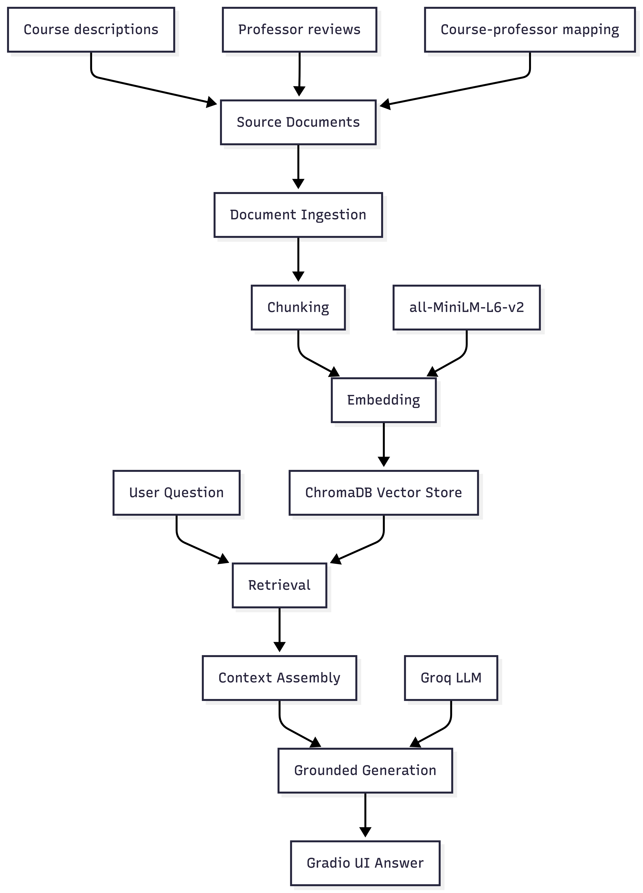

# Project 1 Planning: The Unofficial Guide

> Write this document before you write any pipeline code.
> Your spec and architecture diagram are what you'll use to direct AI tools (Claude, Copilot, etc.) to generate your implementation — the more specific they are, the more useful the generated code will be.
> Update the Retrieval Approach and Chunking Strategy sections if you change your approach during implementation.
> Update this file before starting any stretch features.

---

## Domain

This project is an unofficial guide to UIUC Industrial Engineering courses and professors. It combines official course descriptions with structured student professor reviews so students can ask questions about course content, prerequisites, workload, teaching style, difficulty, and student experiences in one place. This knowledge is hard to find through official channels because course catalogs explain topics and prerequisites, but they do not capture student-reported experiences like grading style, lecture clarity, workload, accessibility, or whether a course feels project-heavy.

---

## Documents

| # | Source | Description | URL or location |
|---|--------|-------------|-----------------|
| 1 | IE course descriptions | Official-style UIUC Industrial Engineering course descriptions, credits, prerequisites, and topics. | `docs/ie_courses_desc.txt` |
| 2 | Professor reviews dataset | Structured public student reviews for UIUC Industrial Engineering and related professors. | `docs/uiuc_ie_professor_reviews.txt` |
| 3 | Course-professor mapping | Connects IE courses to professors with available review data. | `docs/course_professor_mapping.txt` |
| 4 | Source inventory | List of source URLs and local files used to build the corpus. | `docs/source_inventory.txt` |
| 5 | UIUC Course Catalog — IE Industrial Engineering | Official UIUC catalog page for Industrial Engineering courses. | https://catalog.illinois.edu/courses-of-instruction/ie/ |
| 6 | UIUC Course Explorer — IE Fall 2026 | UIUC Course Explorer schedule/listing for Industrial Engineering courses. | https://courses.illinois.edu/schedule/2026/fall/IE |
| 7 | Rate My Professors — Chrysafis Vogiatzis | Student reviews for Chrysafis Vogiatzis, especially IE 300 and IE 398. | https://www.ratemyprofessors.com/professor/2537290 |
| 8 | Rate My Professors — Harrison Kim | Student reviews for Harrison Kim, especially IE 431 and GE 310. | https://www.ratemyprofessors.com/professor/1887905 |
| 9 | Rate My Professors — R.S. Sreenivas | Student reviews for R.S. Sreenivas, including GE 424, IE 523, and GE 320. | https://www.ratemyprofessors.com/professor/778643 |
| 10 | Rate My Professors — Karthekeyan Chandrasekaran | Student reviews for Karthekeyan Chandrasekaran, especially IE 310. | https://www.ratemyprofessors.com/professor/2440361 |
| 11 | Rate My Professors — Lavanya Marla | Student reviews for Lavanya Marla, especially IE 360 and IE 498. | https://www.ratemyprofessors.com/professor/1836373 |
| 12 | Rate My Professors — David Lariviere | Student reviews for David Lariviere, especially IE 420 and IE 421. | https://www.ratemyprofessors.com/professor/2912372 |
| 13 | Rate My Professors — Carolyn Beck | Student reviews for Carolyn Beck, including IE 300, SE 424, GE 424, and IE 529. | https://www.ratemyprofessors.com/professor/1836374 |
| 14 | Rate My Professors — Jugal Garg | Student reviews for Jugal Garg, especially IE 405 and IE 498. | https://www.ratemyprofessors.com/professor/2266447 |
| 15 | Rate My Professors — Molly Goldstein | Student reviews for Molly Goldstein, especially SE 101. | https://www.ratemyprofessors.com/professor/2412305 |
| 16 | Rate My Professors — Richard Sowers | Student reviews for Richard Sowers, especially MATH 241. | https://www.ratemyprofessors.com/professor/257568 |

---

## Chunking Strategy

<!-- How will you split documents into chunks?
     State your chunk size (in tokens or characters), overlap size, and explain why those
     numbers fit the structure of your documents.
     A review-heavy corpus warrants different chunking than a long FAQ. -->

**Chunk size:** Structure-aware chunks, with a 500-character fallback limit for oversized records.

**Overlap:** 75 characters only for oversized records that need fallback sliding-window splitting.

**Reasoning:**
My documents are structured around course records, professor sections, and individual student reviews. A fixed character window sometimes separated professor names or course headers from the review text. I changed the chunking approach to split on natural boundaries first: separator lines, course headers, professor sections, and review blocks. Only records longer than the chunk size fall back to a 500-character / 75-overlap sliding window. This keeps most chunks self-contained while still handling long course descriptions.

---

## Retrieval Approach

<!-- Which embedding model are you using (e.g., all-MiniLM-L6-v2 via sentence-transformers)?
     How many chunks will you retrieve per query (top-k)?
     If you were deploying this for real users and cost wasn't a constraint, what tradeoffs
     would you weigh in choosing a different embedding model — context length, multilingual
     support, accuracy on domain-specific text, latency? -->

**Embedding model:** all-MiniLM-L6-v2 via sentence-transformers

**Top-k:** 4 or 5

**Production tradeoff reflection:**
I would choose top-k = 5 for this domain because professor/course questions may need both:
one course description chunk
one professor review chunk
one mapping chunk
Too few chunks could miss the professor-review connection. Too many chunks could bring noisy reviews from unrelated professors or courses.

---

## Evaluation Plan

<!-- List your 5 test questions with their expected correct answers.
     Questions should be specific enough that you can judge whether the system's response
     is right or wrong. "What are good dining halls?" is too vague.
     "What do students say about wait times at [dining hall name] during lunch?" is testable. -->

| # | Question | Expected answer |
|---|----------|-----------------|
| 1 | What is IE 310 about, and what prerequisite does it require? | IE 310 covers deterministic optimization topics such as simplex, duality, sensitivity analysis, transportation/assignment problems, network optimization, dynamic programming, nonlinear optimization, and discrete optimization. It requires credit or concurrent registration in MATH 257 or MATH 415. |
| 2 | Which IE courses involve programming? | IE 405 involves C++, algorithm design, and SQL; IE 421 expects programming/data structures knowledge; IE 434 involves PyTorch; IE 517 uses Python, pandas, NumPy, and scikit-learn. |
| 3 | What do students say about Chrysafis Vogiatzis for IE 300? | Reviews are generally very positive; students describe him as caring, accessible, helpful, and strong at explaining concepts, though IE 300 can still be challenging. |
| 4 | Is IE 421 project-heavy? | Yes, reviews for David Lariviere’s IE 421 mention a semester-long group project and that the grade is mostly or almost entirely based on project performance. |
| 5 | What do students say about Harrison Kim’s IE 431 workload? | Reviews mention attendance, weekly review, case studies, quizzes, exams, and that students should keep up because the course can require significant effort. |

---

## Anticipated Challenges

<!-- What could go wrong? Name at least two specific risks with reasoning.
     Consider: noisy or inconsistent documents, missing source attribution, off-topic
     retrieval, chunks that split key information across boundaries. -->

1. Professor reviews are subjective and sometimes emotional, so the system should frame answers as student-reported feedback rather than objective fact.

2. If chunks are too small, reviews may be separated from professor names, course numbers, or ratings. That could make retrieval return useful text without enough context.

3. Some questions require information from multiple documents, such as combining official course descriptions with professor reviews.

---

## Architecture

<!-- Draw a diagram of your pipeline showing the five stages:
     Document Ingestion → Chunking → Embedding + Vector Store → Retrieval → Generation
     Label each stage with the tool or library you're using.
     You can use ASCII art, a Mermaid diagram, or embed a sketch as an image.
     You'll use this diagram as context when prompting AI tools to implement each stage. -->

---

## AI Tool Plan

<!-- For each part of the pipeline below, describe:
     - Which AI tool you plan to use (Claude, Copilot, ChatGPT, etc.)
     - What you'll give it as input (which sections of this planning.md, which requirements)
     - What you expect it to produce
     - How you'll verify the output matches your spec

     "I'll use AI to help me code" is not a plan.
     "I'll give Claude my Chunking Strategy section and ask it to implement chunk_text()
     with my specified chunk size and overlap" is a plan. -->

**Milestone 3 — Ingestion and chunking:**

**Milestone 4 — Embedding and retrieval:**

**Milestone 5 — Generation and interface:**
